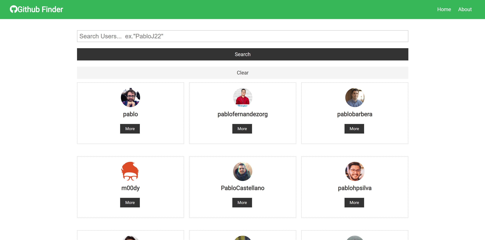

## "GitHub-Finder" - React Application

Search a GitHub Username and view their profile.  
Site Deployed using Netlify.

---

React application built using Functional Components, new React Hooks(useContext, useReducer), and Context API. 

&#9745; useContext

&#9745; useReducer

&#9745; useState

&#9745; Functional Components

### `Visit Deployed Site -->` https://react-githubfinder.netlify.com/

